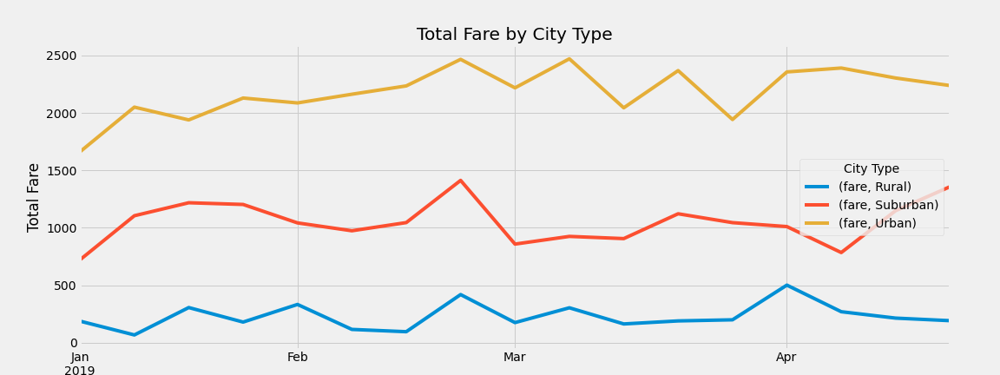

# Pyber_Analysis

## Overview of Project

### Purpose
The purpose of the Pyber_Analysis is to evaluate the ride-sharing data provided by V.Isualize, the CEO, and visually portray fare by city type for each week. 

## Results

Based on reviewing the results of our analysis, it appears that the different city types have similar patterns in terms of weekly performance with dips and peaks. Not surprisingly, Urban areas had the highest total fares in any given week, followed by suburban, followed by rural. Based on the laws of supply and demand, despite the fact that there is more drivers in urban areas, the average share per driver is more expensive in rural areas. This is conclusion is supported by the analysis performed as part of this exercise as well. 

  
## Pyber Analysis Summary

Based on the results, three recommendations to the CEO for addressing disparties among the city types are: 
  * Looking into additional insight that could not be gathered from our current analysis, such as length of the ride, demographics of riders, etc. 
  * Consider incentivizing additional drivers in rural areas so that the average fare per ride would be more aligned with the other two city types
  * Incentivize riders in rural areas so that there will be more rides in rural areas and as such, more data for us to evaluate since currently the data is very urban heavy 
